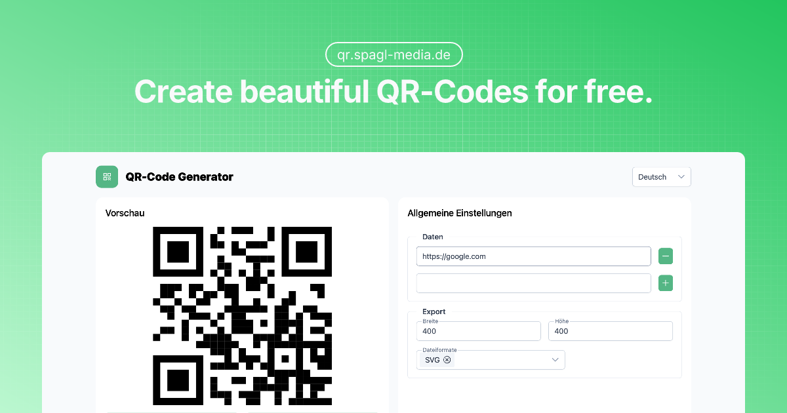

<div align="center">
  <a href="https://your-qr-generator-url.com" target="_blank">
    
  </a>
  <h1>QR Code Generator</h1>
  <p>
    A modern, feature-rich QR code generator built with Nuxt 3 and Vue 3
  </p>
  <div>
    <!-- <a href="https://github.com/yourusername/qr-code-generator/actions" target="_blank">
      
    </a> -->
    <!-- <a href="https://github.com/yourusername/qr-code-generator/blob/main/LICENSE" target="_blank">
       -->
    </a>
  </div>
  <div>
    <a href="https://qr.spagl-media.de" target="_blank">🌐 Live Demo</a>
    <span> • </span>
    <a href="#features">✨ Features</a>
    <span> • </span>
    <a href="#getting-started">🚀 Getting Started</a>
    <span> • </span>
    <a href="#contributing">🤝 Contributing</a>
  </div>
  <br/>
</div>

## ✨ Features

- 🎨 Customizable QR codes with various styles and colors
- 📱 Responsive design that works on all devices
- 📥 Download QR codes in multiple formats (PNG, SVG, JPEG)
- ↔️ Batch processing
- 🌍 Multi-language support
- ⚡ Built with Nuxt 3 for optimal performance

## 🚀 Getting Started

### Prerequisites

- Node.js 18+
- [bun](https://bun.sh/) - Fast JavaScript runtime and package manager
- Git

### Installation

1. Clone the repository:
   ```bash
   git clone https://github.com/yourusername/qr-code-generator.git
   cd qr-code-generator
   ```

2. Install dependencies:
   ```bash
   bun install
   ```

3. Start the development server:
   ```bash
   bun run dev
   ```

4. Open [http://localhost:3000](http://localhost:3000) in your browser.

### Building for Production

```bash
# Build the application for production
bun run build

# Preview the production build
bun run preview

# Generate static project
bun run generate
```

## 🛠️ Built With

- [Nuxt 3](https://nuxt.com/) - The Intuitive Web Framework
- [Vue 3](https://vuejs.org/) - The Progressive JavaScript Framework
- [PrimeVue](https://primevue.org/) - UI Component Library
- [Tailwind CSS](https://tailwindcss.com/) - A utility-first CSS framework
- [QR Code Styling](https://github.com/kozakdenys/qr-code-styling) - QR code styling library

## 🤝 Contributing

Contributions are what make the open source community such an amazing place to learn, inspire, and create. Any contributions you make are **greatly appreciated**.

1. Fork the Project
2. Create your Feature Branch (`git checkout -b feature/AmazingFeature`)
3. Commit your Changes (`git commit -m 'Add some AmazingFeature'`)
4. Push to the Branch (`git push origin feature/AmazingFeature`)
5. Open a Pull Request

<!-- ## 📄 License

Distributed under the MIT License. See `LICENSE` for more information. -->


## 🙏 Acknowledgments

- [QR Code Styling Library](https://github.com/kozakdenys/qr-code-styling)
- [Nuxt.js](https://nuxtjs.org/)
- [Vue.js](https://vuejs.org/)
- [PrimeVue](https://primevue.org/)

---

<div align="center">
  Made with ❤️ by Säm
</div>
